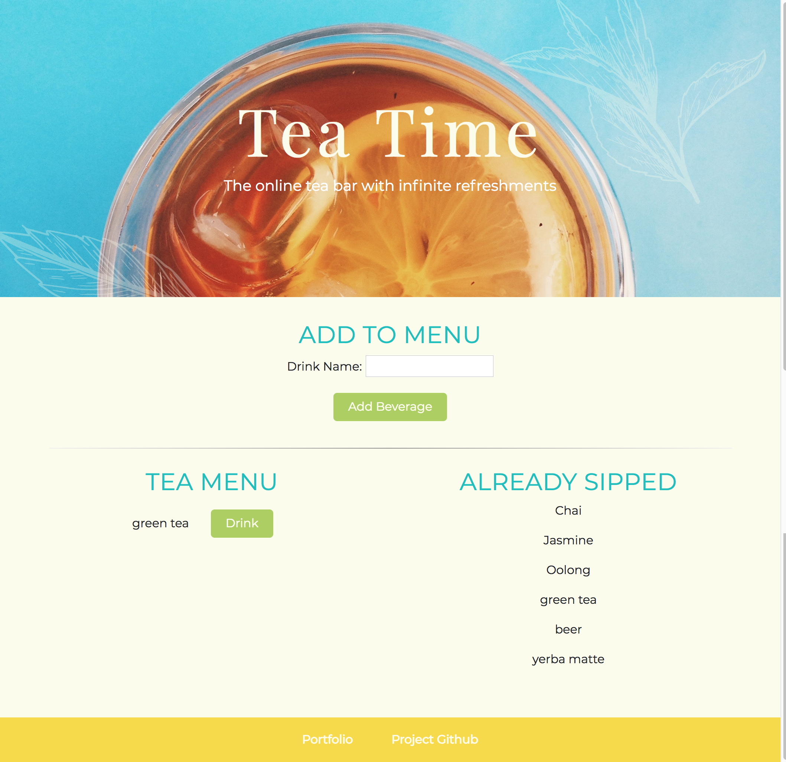

# handlebars_food

An "online tea bar" where you enter what you want to drink to a menu, drink it, and then have your refreshment placed into a beverage history. Created with MySQL, Node, Express, Handlebars and a homemade ORM (yum!). Used MVC design pattern, Node, MySQL, and Handlebars.

Future plans are to recreate with sequalize and clean up some of the design.

Check out the app here: https://pure-cove-53591.herokuapp.com/

Or on the Portfolio page: https://bmjanuska.github.io/BernadetteJanuska_Portfolio/
